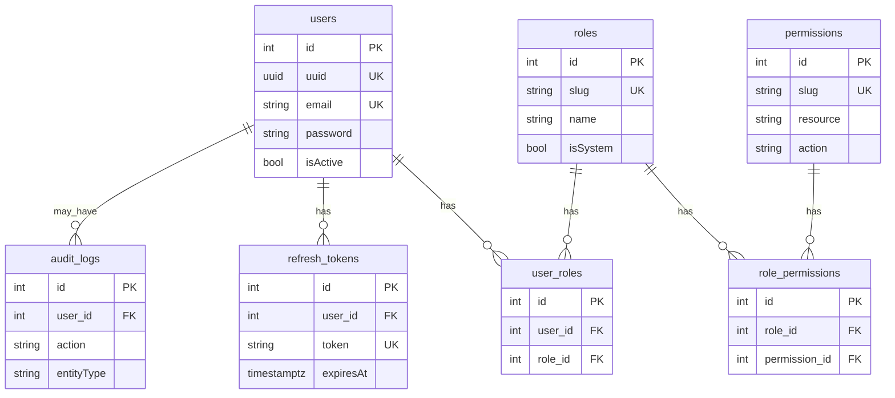
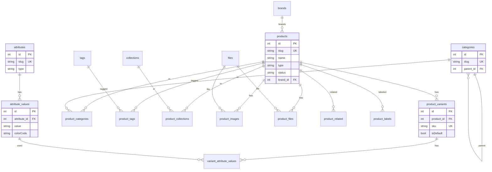
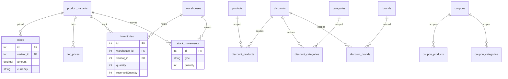
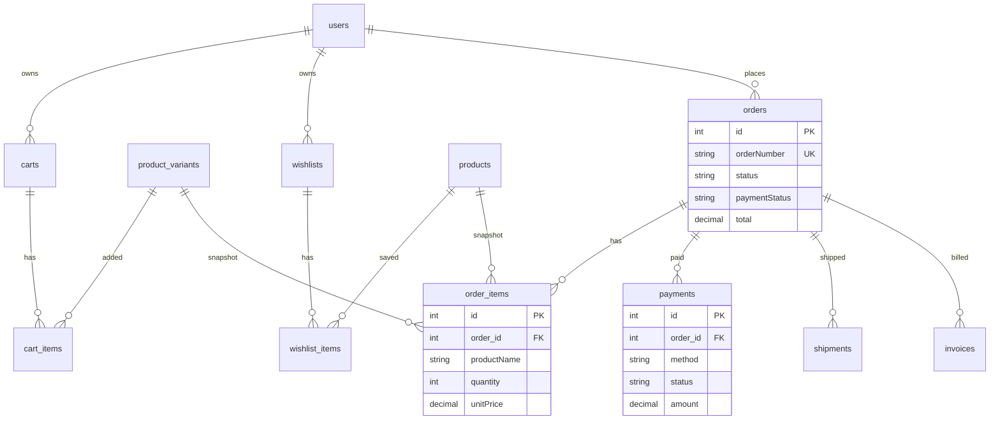
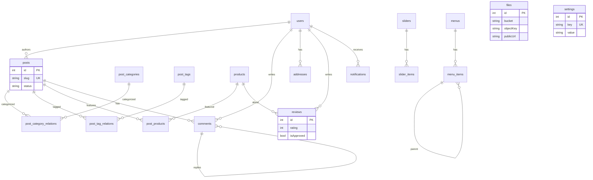

# Liven Database Schema

Online clothing store schema. Source of truth for TypeORM entities under `api/src/entities/`.

**How to update:** When you add/change an entity, update the matching section here and the Mermaid diagram in the same domain group.

## Conventions

| Rule | Detail |
|------|--------|
| Table names | snake_case plural (exact list below) |
| Primary key | `id` (serial) + `uuid` on main entities via `AbstractEntity` |
| Soft delete | `deletedAt` on main entities only; junctions are hard-deleted |
| Money | `decimal(12,2)` on variants via `prices` / order snapshots |
| Variants | SKU, stock (`inventories`), and price live on `product_variants` |
| Attributes | Flexible EAV: Size / Color / Material without hardcoding |
| Roles | `roles` + `user_roles` — no enum column on `users` |

## Table inventory

### Auth
`users`, `roles`, `permissions`, `user_roles`, `role_permissions`, `refresh_tokens`, `audit_logs`

### Catalog
`categories`, `brands`, `collections`, `tags`

### Products
`products`, `product_variants`, `attributes`, `attribute_values`, `variant_attribute_values`, `product_categories`, `product_images`, `product_files`, `product_tags`, `product_collections`, `product_related`, `product_labels`

### Pricing
`prices`, `tier_prices`, `discounts`, `discount_products`, `discount_categories`, `discount_brands`, `coupons`, `coupon_products`, `coupon_categories`

### Inventory
`warehouses`, `inventories`, `stock_movements`

### Shopping
`carts`, `cart_items`, `wishlists`, `wishlist_items`

### Orders
`orders`, `order_items`, `payments`, `shipments`, `invoices`

### Content
`posts`, `post_categories`, `post_tags`, `post_products`, `post_category_relations`, `post_tag_relations`, `comments`

### Media
`files`

### CMS
`banners`, `sliders`, `slider_items`, `menus`, `menu_items`, `pages`, `settings`

### Customer
`addresses`, `reviews`, `notifications`, `newsletter_subscribers`, `contact_messages`

---

## Auth



## Catalog + Products



## Pricing + Inventory



## Shopping + Orders



## Content + Media + CMS + Customer



## Seeded roles

| slug | name |
|------|------|
| `user` | User |
| `admin` | Admin |
| `super_admin` | Super Admin |

Default super admin (from env / seed): `superadmin@liven.local`

## Entity path map

```
api/src/entities/
  auth/       catalog/    products/   pricing/
  inventory/  shopping/   orders/     content/
  media/      cms/        customer/   enums/
  common/abstract.entity.ts
  index.ts    # ALL_ENTITIES
```
